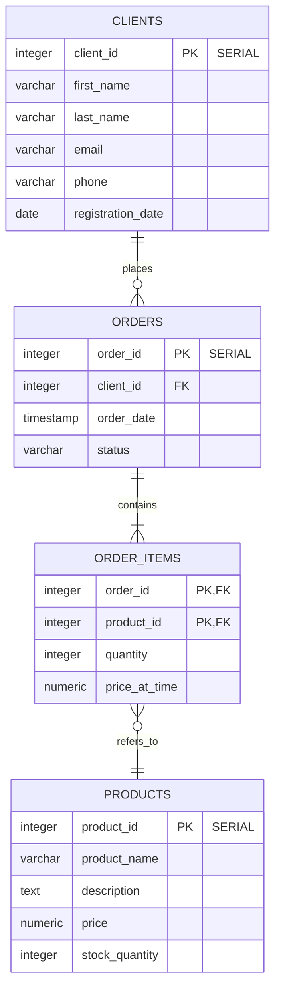

**Лабораторные работы по БД**

Перечень [лабораторные работы](https://edu.irnok.net/lib/exe/fetch.php?media=db:%D0%B2%D0%B0%D1%80%D0%B8%D0%B0%D0%BD%D1%82%D1%8B_%D0%B7%D0%B0%D0%B4%D0%B0%D0%BD%D0%B8%D0%B9_%D0%BF%D0%BE_%D1%83%D0%B4.pdf)

Telegram: [@your_username]

# Постановка задачи (Ваш вариант)

**Магазин электронной техники (подобный M.Video)**

*Сущности:* Клиенты (ID, ФИО, контактные данные), Товары (название, описание, цена, количество на складе), Заказы (номер, дата, статус), Состав заказа (товар, количество, цена на момент покупки).

*Процессы:* Клиенты оформляют заказы на товары. В заказ может входить несколько товаров в разном количестве. Фиксируется статус заказа (Новый, Подтвержден, Отправлен, Доставлен, Отменен) и цена товара на момент покупки.

*Выходные документы:*
  - Для заданного клиента вывести список всех его заказов с общей суммой каждого заказа, отсортированный по дате (сначала новые).
  - Выдать топ-5 самых продаваемых товаров за указанный период, отсортированный по количеству проданных единиц (по убыванию).

# Лабораторная работа 1 (Проектирование логической и физической модели БД)

## ER-диаграмма




Проверка нормальных форм
Первая нормальная форма (1NF): Соблюдена. Все атрибуты атомарны, строки уникальны, определены первичные ключи.

Вторая нормальная форма (2NF): Соблюдена. Все неключевые атрибуты полностью зависят от всего первичного ключа. В таблице order_items поля quantity и price_at_time зависят от комбинации (order_id, product_id).

Третья нормальная форма (3NF): Соблюдена. Транзитивные зависимости отсутствуют. Например, цена товара price_at_time в order_items фиксируется на момент заказа и не зависит от других неключевых полей.

Лабораторная работа 2 (Создание и наполнение таблиц)
Создание таблиц

```sql
-- 1. Таблица 'clients' (Клиенты)
CREATE TABLE zyryanov_2271.clients (
    client_id SERIAL PRIMARY KEY,
    first_name VARCHAR(50) NOT NULL,
    last_name VARCHAR(50) NOT NULL,
    email VARCHAR(100) UNIQUE NOT NULL,
    phone VARCHAR(20) NULL,
    registration_date DATE NOT NULL DEFAULT CURRENT_DATE
);

-- 2. Таблица 'products' (Товары)
CREATE TABLE zyryanov_2271.products (
    product_id SERIAL PRIMARY KEY,
    product_name VARCHAR(100) NOT NULL,
    description TEXT NULL,
    price NUMERIC(10, 2) NOT NULL CHECK (price >= 0),
    stock_quantity INTEGER NOT NULL DEFAULT 0 CHECK (stock_quantity >= 0)
);

-- 3. Таблица 'orders' (Заказы)
CREATE TABLE zyryanov_2271.orders (
    order_id SERIAL PRIMARY KEY,
    client_id INTEGER NOT NULL REFERENCES zyryanov_2271.clients(client_id),
    order_date TIMESTAMP NOT NULL DEFAULT NOW(),
    status VARCHAR(20) NOT NULL DEFAULT 'Новый' CHECK (status IN ('Новый', 'Подтвержден', 'Отправлен', 'Доставлен', 'Отменен'))
);

-- 4. Таблица 'order_items' (Состав заказа)
CREATE TABLE zyryanov_2271.order_items (
    order_id INTEGER NOT NULL REFERENCES zyryanov_2271.orders(order_id),
    product_id INTEGER NOT NULL REFERENCES zyryanov_2271.products(product_id),
    quantity INTEGER NOT NULL CHECK (quantity > 0),
    price_at_time NUMERIC(10, 2) NOT NULL CHECK (price_at_time >= 0),
    PRIMARY KEY (order_id, product_id)
);
```

```sql
-- Заполняем таблицу 'clients'
INSERT INTO zyryanov_2271.clients (first_name, last_name, email, phone) VALUES
('Иван', 'Петров', 'petrov@mail.com', '+7(900)123-45-67'),
('Мария', 'Сидорова', 'sidorova.m@mail.com', '+7(900)765-43-21'),
('Алексей', 'Кузнецов', 'kuznetsov.a@yandex.ru', NULL),
('Елена', 'Смирнова', 'smirnova.e@mail.com', '+7(901)111-22-33');

-- Заполняем таблицу 'products'
INSERT INTO zyryanov_2271.products (product_name, description, price, stock_quantity) VALUES
('Смартфон XYZ', 'Мощный флагман с лучшей камерой', 89999.99, 15),
('Ноутбук Ultrabook', 'Легкий и производительный, 13 дюймов', 124999.50, 8),
('Беспроводные наушники', 'С шумоподавлением, время работы 20ч', 19999.00, 30),
('Коврик для мыши', 'Большой, игровой, с подсветкой', 1500.00, 100);

-- Заполняем таблицу 'orders'
INSERT INTO zyryanov_2271.orders (client_id, status) VALUES
(1, 'Подтвержден'),
(2, 'Новый'),
(3, 'Доставлен'),
(1, 'Отправлен');

-- Заполняем таблицу 'order_items'
INSERT INTO zyryanov_2271.order_items (order_id, product_id, quantity, price_at_time) VALUES
(1, 1, 1, 89999.99),
(1, 3, 1, 19999.00),
(2, 2, 1, 124999.50),
(3, 4, 2, 1500.00),
(4, 1, 1, 87999.99);
```
```sql
SELECT 
    c.first_name,
    c.last_name,
    o.order_id,
    o.order_date,
    o.status,
    p.product_name,
    oi.quantity,
    oi.price_at_time,
    (oi.quantity * oi.price_at_time) AS total_sum
FROM zyryanov_2271.orders o
JOIN zyryanov_2271.clients c ON o.client_id = c.client_id
JOIN zyryanov_2271.order_items oi ON o.order_id = oi.order_id
JOIN zyryanov_2271.products p ON oi.product_id = p.product_id
ORDER BY o.order_id;
```

# Лабораторная работа 3. Представления и процедуры
## Цель: Освоение механизмов абстракции данных и программных модулей.

## 📋 Задачи:

### Создание представлений для выходных документов
### Разработка хранимых процедур с параметрами
### Представление сложных запросов при помощи представления

### 1.Создание представлений для выходных документов
```sql
CREATE OR REPLACE VIEW zyryanov_2271.active_clients_report
 AS
 SELECT clients.client_id,
    (clients.first_name::text || ' '::text) || clients.last_name::text AS full_name,
    clients.email,
    clients.registration_date
   FROM zyryanov_2271.clients
  WHERE clients.registration_date >= (CURRENT_DATE - '1 year'::interval)
  ORDER BY clients.registration_date DESC;

ALTER TABLE zyryanov_2271.active_clients_report
    OWNER TO student;


```

```sql
CREATE OR REPLACE VIEW zyryanov_2271.monthly_orders_report
 AS
 SELECT o.order_id,
    (c.first_name::text || ' '::text) || c.last_name::text AS client_name,
    o.order_date,
    o.status,
    count(oi.product_id) AS items_count,
    sum(oi.quantity::numeric * oi.price_at_time) AS order_total
   FROM zyryanov_2271.orders o
     JOIN zyryanov_2271.clients c ON o.client_id = c.client_id
     JOIN zyryanov_2271.order_items oi ON o.order_id = oi.order_id
  WHERE o.order_date >= date_trunc('month'::text, CURRENT_DATE::timestamp with time zone)
  GROUP BY o.order_id, c.first_name, c.last_name, o.order_date, o.status
  ORDER BY o.order_date DESC;

ALTER TABLE zyryanov_2271.monthly_orders_report
    OWNER TO student;

```

```sql
CREATE OR REPLACE VIEW zyryanov_2271.products_stock_report
 AS
 SELECT products.product_id,
    products.product_name,
    products.price,
    products.stock_quantity,
        CASE
            WHEN products.stock_quantity = 0 THEN 'Нет в наличии'::text
            WHEN products.stock_quantity < 10 THEN 'Мало'::text
            ELSE 'В наличии'::text
        END AS stock_status
   FROM zyryanov_2271.products
  ORDER BY products.stock_quantity DESC, products.price DESC;

ALTER TABLE zyryanov_2271.products_stock_report
    OWNER TO student;
```
### Создание процедур 
```sql
CREATE OR REPLACE PROCEDURE zyryanov_2271.get_active_clients_report(
    OUT p_total_count bigint,
    IN p_years_back integer DEFAULT 1,
    IN p_min_date date DEFAULT NULL,
    IN p_max_date date DEFAULT NULL,
    IN p_email_pattern text DEFAULT NULL,
    IN p_sort_column text DEFAULT 'registration_date',
    IN p_sort_direction text DEFAULT 'DESC',
    IN p_limit_records integer DEFAULT NULL,
    IN p_offset_records integer DEFAULT 0
)
LANGUAGE plpgsql
AS $$
DECLARE
    v_sql text;
    v_where_conditions text := '';
    v_sort_direction text;
    v_sort_column text;
BEGIN
    -- Валидация направления сортировки
    v_sort_direction := CASE 
        WHEN UPPER(p_sort_direction) = 'ASC' THEN 'ASC'
        ELSE 'DESC'
    END;
    
    -- Валидация колонки для сортировки
    v_sort_column := CASE 
        WHEN p_sort_column IN ('client_id', 'full_name', 'email', 'registration_date') 
        THEN p_sort_column
        ELSE 'registration_date'
    END;
    
    -- Базовое условие
    v_where_conditions := format(
        'registration_date >= CURRENT_DATE - INTERVAL ''%s year''',
        p_years_back
    );
    
    -- Дополнительные фильтры
    IF p_min_date IS NOT NULL THEN
        v_where_conditions := v_where_conditions || 
            format(' AND registration_date >= ''%s''', p_min_date);
    END IF;
    
    IF p_max_date IS NOT NULL THEN
        v_where_conditions := v_where_conditions || 
            format(' AND registration_date <= ''%s''', p_max_date);
    END IF;
    
    IF p_email_pattern IS NOT NULL THEN
        v_where_conditions := v_where_conditions || 
            format(' AND email ILIKE ''%%%s%%''', p_email_pattern);
    END IF;
    
    -- Получение общего количества
    EXECUTE format(
        'SELECT COUNT(*) FROM zyryanov_2271.active_clients_report WHERE %s',
        v_where_conditions
    ) INTO p_total_count;
    
    -- Создание временной таблицы с результатами
    CREATE TEMP TABLE temp_active_clients ON COMMIT DROP AS
    SELECT * FROM zyryanov_2271.active_clients_report
    WHERE registration_date >= CURRENT_DATE - INTERVAL '1 year' * p_years_back
        AND (p_min_date IS NULL OR registration_date >= p_min_date)
        AND (p_max_date IS NULL OR registration_date <= p_max_date)
        AND (p_email_pattern IS NULL OR email ILIKE '%' || p_email_pattern || '%');
    
    -- Возврат данных через временную таблицу
    -- Клиенты будут видны в сессии как temp_active_clients
    RAISE NOTICE 'Результат доступен во временной таблице temp_active_clients';
    RAISE NOTICE 'Всего найдено клиентов: %', p_total_count;
END;
$$;

ALTER PROCEDURE zyryanov_2271.get_active_clients_report(
    bigint, integer, date, date, text, text, text, integer, integer
) OWNER TO student;
```
```sql
CREATE OR REPLACE PROCEDURE zyryanov_2271.get_orders_analysis(
    OUT p_orders_cursor refcursor,
    OUT p_summary_json jsonb,
    OUT p_total_orders bigint,
    OUT p_total_revenue numeric,
    OUT p_avg_order_value numeric,
    IN p_start_date date DEFAULT NULL,
    IN p_end_date date DEFAULT NULL,
    IN p_status_list text[] DEFAULT NULL,
    IN p_min_items integer DEFAULT NULL,
    IN p_min_total numeric DEFAULT NULL,
    IN p_max_total numeric DEFAULT NULL
)
LANGUAGE plpgsql
AS $$
DECLARE
    v_min_date date;
    v_max_date date;
BEGIN
    -- Установка дат по умолчанию
    IF p_start_date IS NULL THEN
        v_min_date := date_trunc('month', CURRENT_DATE);
    ELSE
        v_min_date := p_start_date;
    END IF;
    
    IF p_end_date IS NULL THEN
        v_max_date := v_min_date + INTERVAL '1 month' - INTERVAL '1 day';
    ELSE
        v_max_date := p_end_date;
    END IF;
    
    -- Открытие курсора с данными заказов
    OPEN p_orders_cursor FOR
    SELECT 
        order_id,
        client_name,
        order_date,
        status,
        items_count,
        order_total,
        CASE 
            WHEN order_total > 5000 THEN 'КРУПНЫЙ'
            WHEN order_total > 1000 THEN 'СРЕДНИЙ'
            ELSE 'МАЛЫЙ'
        END as order_size_category
    FROM zyryanov_2271.monthly_orders_report
    WHERE 
        order_date BETWEEN v_min_date AND v_max_date
        AND (p_status_list IS NULL OR status = ANY(p_status_list))
        AND (p_min_items IS NULL OR items_count >= p_min_items)
        AND (p_min_total IS NULL OR order_total >= p_min_total)
        AND (p_max_total IS NULL OR order_total <= p_max_total)
    ORDER BY order_date DESC, order_total DESC;
    
    -- Получение агрегированной статистики
    SELECT 
        COUNT(*),
        COALESCE(SUM(order_total), 0),
        COALESCE(AVG(order_total), 0)
    INTO 
        p_total_orders,
        p_total_revenue,
        p_avg_order_value
    FROM zyryanov_2271.monthly_orders_report
    WHERE order_date BETWEEN v_min_date AND v_max_date
        AND (p_status_list IS NULL OR status = ANY(p_status_list))
        AND (p_min_items IS NULL OR items_count >= p_min_items)
        AND (p_min_total IS NULL OR order_total >= p_min_total)
        AND (p_max_total IS NULL OR order_total <= p_max_total);
    
    -- Формирование JSON-суммаризации
    p_summary_json := jsonb_build_object(
        'period', jsonb_build_object(
            'start_date', v_min_date,
            'end_date', v_max_date
        ),
        'filters_applied', jsonb_build_object(
            'status_list', COALESCE(p_status_list, '{}'::text[]),
            'min_items', p_min_items,
            'min_total', p_min_total,
            'max_total', p_max_total
        ),
        'statistics', jsonb_build_object(
            'total_orders', p_total_orders,
            'total_revenue', ROUND(p_total_revenue, 2),
            'avg_order_value', ROUND(p_avg_order_value, 2)
        )
    );
    
    RAISE NOTICE 'Анализ заказов завершен. Используйте курсор для получения данных.';
END;
$$;

ALTER PROCEDURE zyryanov_2271.get_orders_analysis(
    refcursor, jsonb, bigint, numeric, numeric,
    date, date, text[], integer, numeric, numeric
) OWNER TO student;
```

```sql
CREATE OR REPLACE PROCEDURE zyryanov_2271.get_inventory_report(
    OUT p_report_cursor refcursor,
    OUT p_summary_stats jsonb,
    OUT p_total_products bigint,
    OUT p_low_stock_count bigint,
    OUT p_total_inventory_value numeric,
    IN p_stock_status text DEFAULT NULL,
    IN p_min_price numeric DEFAULT NULL,
    IN p_max_price numeric DEFAULT NULL,
    IN p_min_quantity integer DEFAULT NULL,
    IN p_max_quantity integer DEFAULT NULL,
    IN p_action text DEFAULT 'view',
    IN p_critical_threshold integer DEFAULT 10,
    IN p_excess_threshold integer DEFAULT 100
)
LANGUAGE plpgsql
AS $$
DECLARE
    v_where_conditions text := '';
    v_sql_conditions text := '';
BEGIN
    -- Формирование условий WHERE в зависимости от action
    CASE p_action
        WHEN 'critical' THEN
            v_where_conditions := 'stock_quantity < ' || p_critical_threshold;
        WHEN 'excess' THEN
            v_where_conditions := 'stock_quantity > ' || p_excess_threshold;
        ELSE
            v_where_conditions := '1=1';
    END CASE;
    
    -- Добавление дополнительных фильтров
    IF p_stock_status IS NOT NULL THEN
        v_where_conditions := v_where_conditions || 
            ' AND stock_status = ''' || p_stock_status || '''';
    END IF;
    
    IF p_min_price IS NOT NULL THEN
        v_where_conditions := v_where_conditions || 
            ' AND price >= ' || p_min_price;
    END IF;
    
    IF p_max_price IS NOT NULL THEN
        v_where_conditions := v_where_conditions || 
            ' AND price <= ' || p_max_price;
    END IF;
    
    IF p_min_quantity IS NOT NULL THEN
        v_where_conditions := v_where_conditions || 
            ' AND stock_quantity >= ' || p_min_quantity;
    END IF;
    
    IF p_max_quantity IS NOT NULL THEN
        v_where_conditions := v_where_conditions || 
            ' AND stock_quantity <= ' || p_max_quantity;
    END IF;
    
    -- Открытие курсора с данными
    OPEN p_report_cursor FOR
    EXECUTE format(
        'SELECT * FROM zyryanov_2271.products_stock_report
         WHERE %s
         ORDER BY 
            CASE stock_status
                WHEN ''Нет в наличии'' THEN 1
                WHEN ''Мало'' THEN 2
                ELSE 3
            END,
            stock_quantity,
            price DESC',
        v_where_conditions
    );
    
    -- Сбор статистики
    EXECUTE format(
        'SELECT 
            COUNT(*),
            SUM(CASE WHEN stock_status IN (''Нет в наличии'', ''Мало'') THEN 1 ELSE 0 END),
            SUM(price * stock_quantity)
         FROM zyryanov_2271.products_stock_report
         WHERE %s',
        v_where_conditions
    ) INTO p_total_products, p_low_stock_count, p_total_inventory_value;
    
    -- Формирование JSON статистики
    p_summary_stats := jsonb_build_object(
        'inventory_summary', jsonb_build_object(
            'total_products', p_total_products,
            'low_stock_items', p_low_stock_count,
            'total_inventory_value', ROUND(COALESCE(p_total_inventory_value, 0), 2),
            'average_price', CASE 
                WHEN p_total_products > 0 
                THEN ROUND(COALESCE(p_total_inventory_value, 0) / NULLIF(p_total_products, 0), 2)
                ELSE 0 
            END
        ),
        'filters', jsonb_build_object(
            'stock_status', p_stock_status,
            'price_range', jsonb_build_object('min', p_min_price, 'max', p_max_price),
            'quantity_range', jsonb_build_object('min', p_min_quantity, 'max', p_max_quantity),
            'action', p_action
        )
    );
    
    RAISE NOTICE 'Отчет по запасам сгенерирован. Используйте курсор для получения данных.';
END;
$$;

ALTER PROCEDURE zyryanov_2271.get_inventory_report(
    refcursor, jsonb, bigint, bigint, numeric,
    text, numeric, numeric, integer, integer, text, integer, integer
) OWNER TO student;
```
### Запросы к представлениям 

```sql
CALL zyryanov_2271.get_active_clients_report(NULL, 1, NULL, NULL, 'gmail.com', 'full_name', 'ASC', 50, 0);
SELECT * FROM temp_active_clients;

-- Все товары с сортировкой по наличию
SELECT *
FROM zyryanov_2271.products_stock_report
ORDER BY 
    CASE stock_status
        WHEN 'Нет в наличии' THEN 1
        WHEN 'Мало' THEN 2
        ELSE 3
    END,
    stock_quantity;

-- Товары с низким запасом
SELECT *
FROM zyryanov_2271.products_stock_report
WHERE stock_status IN ('Мало', 'Нет в наличии')
ORDER BY stock_quantity, price DESC;

-- Товары по ценовым категориям
SELECT 
    CASE 
        WHEN price < 500 THEN 'Эконом'
        WHEN price BETWEEN 500 AND 2000 THEN 'Стандарт'
        WHEN price BETWEEN 2001 AND 5000 THEN 'Премиум'
        ELSE 'Люкс'
    END as price_category,
    COUNT(*) as product_count,
    SUM(stock_quantity) as total_stock,
    SUM(price * stock_quantity) as total_value
FROM zyryanov_2271.products_stock_report
GROUP BY 
    CASE 
        WHEN price < 500 THEN 'Эконом'
        WHEN price BETWEEN 500 AND 2000 THEN 'Стандарт'
        WHEN price BETWEEN 2001 AND 5000 THEN 'Премиум'
        ELSE 'Люкс'
    END
ORDER BY total_value DESC;

-- Товары требующие пополнения (меньше 10 штук)
SELECT *
FROM zyryanov_2271.products_stock_report
WHERE stock_quantity < 10
ORDER BY stock_quantity;

-- Самые дорогие товары в наличии
SELECT *
FROM zyryanov_2271.products_stock_report
WHERE stock_status = 'В наличии'
ORDER BY price DESC
LIMIT 10;

-- Общая статистика по запасам
SELECT 
    stock_status,
    COUNT(*) as product_count,
    SUM(stock_quantity) as total_quantity,
    SUM(price * stock_quantity) as total_value,
    AVG(price) as avg_price
FROM zyryanov_2271.products_stock_report
GROUP BY stock_status
ORDER BY 
    CASE stock_status
        WHEN 'Нет в наличии' THEN 1
        WHEN 'Мало' THEN 2
        ELSE 3
    END;
 ```


# 4 Лабораторная работа Анализ производительности
## Цель: Освоение методов анализа и оптимизации производительности БД.

📋 Задачи:

### Создание генератора данных (20 000 записей в каждой таблице)
### Анализ планов выполнения запросов (EXPLAIN ANALYZE)
### Оптимизация БД через индексы и настройки
### Сравнение производительности до/после оптимизации

#### Создание генератора данных (20 000 записей в каждой таблице)
```sql
-- PROCEDURE: zyryanov_2271.generate_clients_data(integer)

-- DROP PROCEDURE IF EXISTS zyryanov_2271.generate_clients_data(integer);

CREATE OR REPLACE PROCEDURE zyryanov_2271.generate_clients_data(
	IN p_count integer DEFAULT 20000)
LANGUAGE 'plpgsql'
AS $BODY$
DECLARE
    i INTEGER;
    first_names TEXT[] := ARRAY['Иван', 'Мария', 'Алексей', 'Елена', 'Дмитрий', 'Ольга', 'Сергей', 'Анна', 'Андрей', 'Наталья'];
    last_names TEXT[] := ARRAY['Иванов', 'Петров', 'Сидоров', 'Кузнецов', 'Смирнов', 'Попов', 'Васильев', 'Новиков', 'Федоров', 'Морозов'];
    domains TEXT[] := ARRAY['mail.ru', 'gmail.com', 'yandex.ru', 'hotmail.com'];
BEGIN
    FOR i IN 1..p_count LOOP
        INSERT INTO zyryanov_2271.clients (
            first_name, 
            last_name, 
            email, 
            phone, 
            registration_date
        ) VALUES (
            first_names[1 + (i % array_length(first_names, 1))],
            last_names[1 + ((i + 2) % array_length(last_names, 1))],
            'client_' || (EXTRACT(EPOCH FROM NOW())::BIGINT + i) || '@' || domains[1 + (i % array_length(domains, 1))],
            CASE WHEN i % 10 != 0 THEN '+7(9' || LPAD((i % 1000000)::TEXT, 9, '0') ELSE NULL END,
            CURRENT_DATE - (RANDOM() * 365 * 2)::INTEGER
        );
        
        IF i % 5000 = 0 THEN
            RAISE NOTICE 'Сгенерировано клиентов: %', i;
        END IF;
    END LOOP;
END;
$BODY$;
ALTER PROCEDURE zyryanov_2271.generate_clients_data(integer)
    OWNER TO student;

```
```sql
-- PROCEDURE: zyryanov_2271.generate_products_data(integer)

-- DROP PROCEDURE IF EXISTS zyryanov_2271.generate_products_data(integer);

CREATE OR REPLACE PROCEDURE zyryanov_2271.generate_products_data(
	IN p_count integer DEFAULT 20000)
LANGUAGE 'plpgsql'
AS $BODY$
DECLARE
    i INTEGER;
    categories TEXT[] := ARRAY['Электроника', 'Одежда', 'Книги', 'Мебель', 'Спорт', 'Красота', 'Авто', 'Дом', 'Игрушки', 'Еда'];
    products TEXT[] := ARRAY['Смартфон', 'Ноутбук', 'Планшет', 'Наушники', 'Телевизор', 'Фотоаппарат', 'Часы', 'Игровая консоль'];
BEGIN
    FOR i IN 1..p_count LOOP
        INSERT INTO zyryanov_2271.products (
            product_name,
            description,
            price,
            stock_quantity
        ) VALUES (
            products[1 + (i % array_length(products, 1))] || ' ' || 
                (ARRAY['Pro', 'Max', 'Lite', 'Ultra', 'Premium'])[1 + ((i+1) % 5)] || ' ' || i,
            'Высококачественный ' || products[1 + (i % array_length(products, 1))] || 
                ' в категории ' || categories[1 + (i % array_length(categories, 1))],
            (RANDOM() * 100000 + 1000)::NUMERIC(10,2),
            (RANDOM() * 1000)::INTEGER
        );
        
        IF i % 5000 = 0 THEN
            RAISE NOTICE 'Сгенерировано товаров: %', i;
        END IF;
    END LOOP;
END;
$BODY$;
ALTER PROCEDURE zyryanov_2271.generate_products_data(integer)
    OWNER TO student;
```
```sql
-- PROCEDURE: zyryanov_2271.generate_orders_data_quick(integer)

-- DROP PROCEDURE IF EXISTS zyryanov_2271.generate_orders_data_quick(integer);

CREATE OR REPLACE PROCEDURE zyryanov_2271.generate_orders_data_quick(
	IN p_count integer DEFAULT 20000)
LANGUAGE 'plpgsql'
AS $BODY$
DECLARE
    client_ids INTEGER[];
    product_ids INTEGER[];
    client_count INTEGER;
    product_count INTEGER;
BEGIN
    RAISE NOTICE 'Начало быстрой генерации заказов...';
    
    -- Получаем ID клиентов и товаров
    SELECT ARRAY(SELECT client_id FROM zyryanov_2271.clients) INTO client_ids;
    SELECT ARRAY(SELECT product_id FROM zyryanov_2271.products) INTO product_ids;
    
    client_count := array_length(client_ids, 1);
    product_count := array_length(product_ids, 1);
    
    -- Создаем заказы одним запросом
    WITH new_orders AS (
        INSERT INTO zyryanov_2271.orders (
            client_id,
            order_date,
            status
        )
        SELECT 
            client_ids[1 + ((seq - 1) % client_count)],
            CURRENT_TIMESTAMP - (random() * 365 * 24 * 60 * 60 * INTERVAL '1 second'),
            (ARRAY['Новый', 'Подтвержден', 'Отправлен', 'Доставлен', 'Отменен'])[1 + (seq % 5)]
        FROM generate_series(1, p_count) as seq
        RETURNING order_id
    )
    -- Создаем элементы заказов одним запросом
    INSERT INTO zyryanov_2271.order_items (
        order_id,
        product_id,
        quantity,
        price_at_time
    )
    SELECT 
        no.order_id,
        product_ids[1 + ((no.order_id + item_num - 1) % product_count)],
        (1 + (floor(random() * 9)::INTEGER) + 1),
        p.price
    FROM new_orders no
    CROSS JOIN generate_series(1, (1 + (floor(random() * 4)::INTEGER))) as item_num
    JOIN zyryanov_2271.products p ON p.product_id = product_ids[1 + ((no.order_id + item_num - 1) % product_count)];
    
    RAISE NOTICE 'Быстрая генерация заказов завершена! Создано заказов: %', p_count;
END;
$BODY$;
ALTER PROCEDURE zyryanov_2271.generate_orders_data_quick(integer)
    OWNER TO student;
```

## Анализ плана выполения 
```sql
EXPLAIN (ANALYZE) 
SELECT * FROM zyryanov_2271.clients WHERE email LIKE '%gmail.com%';
```

## создание индексов для оптимизации
```sql
-- FUNCTION: zyryanov_2271.create_optimization_indexes()

-- DROP FUNCTION IF EXISTS zyryanov_2271.create_optimization_indexes();

CREATE OR REPLACE FUNCTION zyryanov_2271.create_optimization_indexes(
	)
    RETURNS void
    LANGUAGE 'plpgsql'
    COST 100
    VOLATILE PARALLEL UNSAFE
AS $BODY$
BEGIN
    RAISE NOTICE 'Создание оптимизированных индексов...';
    
    -- Удаляем старые индексы чтобы избежать конфликтов
    DROP INDEX IF EXISTS zyryanov_2271.idx_clients_email;
    DROP INDEX IF EXISTS zyryanov_2271.idx_clients_email_pattern;
    DROP INDEX IF EXISTS zyryanov_2271.idx_orders_client_id;
    DROP INDEX IF EXISTS zyryanov_2271.idx_orders_client_id_count;
    
    -- 1. Базовые индексы для точного поиска
    CREATE INDEX idx_clients_email ON zyryanov_2271.clients(email);
    RAISE NOTICE 'Создан индекс idx_clients_email';
    
    -- 2. Индекс для LIKE поиска (только с начала строки)
    CREATE INDEX idx_clients_email_pattern ON zyryanov_2271.clients(email varchar_pattern_ops);
    RAISE NOTICE 'Создан индекс idx_clients_email_pattern';
    
    -- 3. Индексы для JOIN оптимизации
    CREATE INDEX idx_orders_client_id ON zyryanov_2271.orders(client_id);
    RAISE NOTICE 'Создан индекс idx_orders_client_id';
    
    -- 4. Покрывающий индекс для агрегации
    CREATE INDEX idx_orders_client_id_count ON zyryanov_2271.orders(client_id, order_id);
    RAISE NOTICE 'Создан индекс idx_orders_client_id_count';
    
    -- 5. Индекс для поиска по дате
    CREATE INDEX idx_orders_date ON zyryanov_2271.orders(order_date);
    RAISE NOTICE 'Создан индекс idx_orders_date';
    
    -- 6. Составной индекс для сложных запросов
    CREATE INDEX idx_clients_covering ON zyryanov_2271.clients(client_id, email, first_name, last_name);
    RAISE NOTICE 'Создан индекс idx_clients_covering';
    
    RAISE NOTICE 'Все индексы успешно созданы!';
END;
$BODY$;

ALTER FUNCTION zyryanov_2271.create_optimization_indexes()
    OWNER TO student;

```